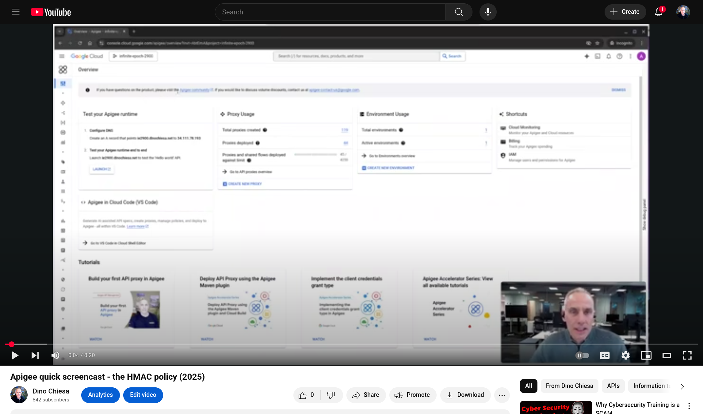

# HMAC Example proxy

This api proxy demonstrates the use of the HMAC policy in Apige.

What's an HMAC?  https://en.wikipedia.org/wiki/HMAC

Typically you'd use an HMAC to sign a message, or verify a signature on
a message. The HMAC function uses a secret (or shared) key.

This example works on Apigee X or hybrid.

## Deploying

Deploy the API proxy to your environment, before trying to invoke it.

## Invoking

Generate an HMAC on a given payload using alg=sha-256, with key secret123:
```
endpoint=https://my-apigee-endpoint.net
curl -i -X POST -d 'the quick brown fox...' \
     "$endpoint/hmac-demo-20230727/sha256/payload?key=secret123"
```

The response is plain text like this:

```
keybytes: 736563726574313233
message: The quick brown fox...
output encoding: BASE16
output: E6D0B7EBD427D47A90D086E20A953A0CEC073C34CC74523F4AE2005EB21D8E3D
```

You can also compute an HMAC on a message composition:

```
curl -i $endpoint/hmac-demo-20230727/sha256/composition\?key=secret123 \
  -d 'The quick brown fox...'
```

The result of this call looks like this:

```
keybytes: 736563726574313233
message: my-apigee-host.net|POST|/hmac-demo-20230727/sha256/composition?key=secret123|The quick brown fox...
output encoding: BASE16
output: 9E5EFA683D8339F9A06AA850B6DF43227C095600F95E58B5AC49EAAC48EBA0BF
```

Finally, you can get help on this demonstration API Proxy with a request like
this:

```
curl -i $endpoint/hmac-demo-20230727/doc
```

## Screencast

You can view [the screencast](https://youtu.be/-xWdoQEwFCI) as well.
[](https://youtu.be/-xWdoQEwFCI).

## Disclaimer

This example is not an official Google product, nor is it part of an
official Google product.


## Support

This callout is open-source software, and is not a supported part of Apigee.  If
you need assistance, you can try inquiring on [the Google Cloud Community forum
dedicated to Apigee](https://goo.gle/apigee-community) There is no service-level
guarantee for responses to inquiries posted to that site.

## License

This material is [Copyright 2023-2025 Google LLC](./NOTICE).
and is licensed under the [Apache 2.0 License](LICENSE). 
